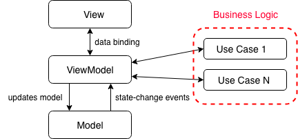

# iOS Clean MVVM architecture demo

This app demonstrates an architecture that I find useful for small to medium sized iOS apps. It is based on MVVM but it extends it by borrowing some concepts from Uncle Bob's [Clean Architecture](https://blog.cleancoder.com/uncle-bob/2012/08/13/the-clean-architecture.html).

The architecture is based on **MVVM (Model - View - ViewModel)**. On top of that there is one significant modification inspired by **Clean Architecture** - ViewModel focuses only on UI logic. All business logic should be done using **Use Cases** (aka Interactors) which are owned by ViewModel. 

Conceptually it looks like this:

### Rules of MVVM:
The description above is abstract and can be interpreted in a number of ways. To make it more easily applicable here are some actionable rules that should be followed in MVVM architecture:

 * `ViewModel` does not have any reference to `View`. `ViewModel` can change `View` by changing the binded properties. `View` will be automatically notified of these changes through data binding.
 * `Model` has no reference to `ViewModel` and no reference to `View`.
 * `View` owns `ViewModel`
 * `View` can have more than one `ViewModel`
 * `View` should have as little logic as possible. No business logic is allowed in `View`.
 * `ViewModel` should not import UIKit. All UI work needs to happen in `View`
 * `ViewModel` should be fully covered with unit tests

**Data Binding**

To implement Data Binding I used a small class called `Dynamic` that I borrowed from Dino Bartosak's blog post [An Introduction to the MVVM Design Pattern
](https://www.toptal.com/ios/swift-tutorial-introduction-to-mvvm). Data Binding is 1-directional (View is automatically notified when ViewModel is changed). If you want to move in the direction of Reactive programming you can use RxSwift instead. It also provides tools for 2-directional data binding and much more.

### Coordinator Pattern
Navigation in the app is done using the **[Coordinator Design Pattern](https://will.townsend.io/2016/an-ios-coordinator-pattern)** . This makes it easy to understand and modify navigation flows. It also breaks tight coupling between ViewControllers making it easy to reuse ViewControllers in a different context. (Typically View Controllers push other ViewControllers creating a hardcoded relationship between them. Coordinator breaks this relationship by acting as a middle man). Ideally all transitions between views should be done inside the Coordinators. This means assigning rootViewController, pushing, popping, presenting and dismissing UIViewControllers.

**What is a Coordinator?**

Coordinator is a piece of code responsible for transitions between ViewControllers. In a small app it can be just one object (e.g. AppCoordinator) which controls navigation of the whole app but typically it will be a better approach to have multiple Coordinators arranged in a hierarchical structure. For example - AppCoordinator which handles navigating to/from Features and child Coordinators for each Feature which handles navigation within this Feature.
Main benefit of using this approach is that all navigation code is in one place so you are sure you didn’t forget anything when you’re changing navigation flows. It also makes it easy to understand the navigation flow of the app because it is in one place. You don’t need to search the code of the whole app to find all places where view controllers are pushed on navigation stack. 
